# 📱 Phrasalito

[](https://kotlinlang.org/)
[](https://developer.android.com/jetpack/compose)
[](https://github.com/BlueAl98/Phrasalito/actions)
[](LICENSE)
[](https://developer.android.com/)
[]()

Phrasalito is a modern Android application built with Kotlin and Jetpack Compose, designed to help users master languages. The app provides an interactive and engaging learning experience through features like customizable decks, flashcards, and completion exercises.

The project is structured following **Clean Architecture** principles and is organized into a **multi-module Gradle setup**, ensuring a scalable, maintainable, and testable codebase.

## ✨ Core Features

* 🗂️ **Deck Management**: Create custom decks to group phrasal verbs by topic or difficulty.
* 💬 **Phrase Flashcards**: Add, edit, and delete phrases within your decks. Each phrase includes the target phrase, its translation, and a usage example.
* 🔄 **Interactive Learning**: Study phrases with an animated flip-card interface.
* 🧠 **Quizzes & Exercises**: Test your knowledge by completing example sentences and instant feedback on your answers.
* ⏰ **Spaced Repetition**: Receive periodic notifications with a random phrase from your decks to reinforce memory, powered by `WorkManager`.
* 🔊 **Text-to-Speech**: Listen to the correct pronunciation of phrases and their examples.
* 🎨 **Clean, Modern UI**: A user-friendly interface built entirely with Jetpack Compose.

## 🏗️ Architecture

The application is built using **Clean Architecture** combined with the **MVVM (Model-View-ViewModel)** pattern. This approach separates concerns into distinct layers, promoting independence and testability.

The project is divided into the following Gradle modules:

*   `app`: The main application module and entry point. It integrates all other feature and core modules and handles top-level navigation.
*   `phrasalito_presentation`: The presentation layer (UI). Contains Jetpack Compose screens, ViewModels, UI state management, and event handling. It depends only on the `domain` module.
*   `phrasalito_domain`: The domain layer. This is the core of the application, containing business logic, models, use cases, and repository interfaces. It has no dependencies on other layers.
*   `phrasalito_data`: The data layer. Implements the repository interfaces defined in the domain layer. It handles data persistence using Room and DataStore and manages the Text-to-Speech engine.
*   `common`: A shared utility module containing constants, extension functions, and helper classes used across the project.

```
+------------------------+      +--------------------------+
|          app           |      |          common          |
+-----------+------------+      +------------+-------------+
            |                              |
            |   +--------------------------+
            |   |                          |
            v   v                          v
+------------------------+      +--------------------------+
| phrasalito_presentation|----->|     phrasalito_domain    |<---+
+-----------+------------+      +------------+-------------+    |
            |                              |                    |
            | Depends on                   | Depends on         |
            v                              v                    |
+------------------------+      +--------------------------+    |
|   phrasalito_data      |------+                          |----+
+------------------------+                                |
 (Implements Repositories)                                |
                                                          |
  (Data Sources: Room, DataStore, TTS) <------------------+
```

## 🛠️ Tech Stack & Key Libraries

*   **Language**: [Kotlin](https://kotlinlang.org/)
*   **UI**: [Jetpack Compose](https://developer.android.com/jetpack/compose) for a fully declarative UI.
*   **Architecture**: Clean Architecture, MVVM, Multi-module.
*   **Asynchronous Programming**: [Kotlin Coroutines](https://kotlinlang.org/docs/coroutines-overview.html) and [Flow](https://kotlinlang.org/docs/flow.html) for managing background tasks and data streams.
*   **Dependency Injection**: [Hilt](https://developer.android.com/training/dependency-injection/hilt-android) for managing dependencies.
*   **Database**: [Room](https://developer.android.com/training/data-storage/room) for local data persistence.
*   **Data Storage**: [DataStore](https://developer.android.com/topic/libraries/architecture/datastore) for storing simple key-value data.
*   **Navigation**: [Jetpack Navigation for Compose](https://developer.android.com/jetpack/compose/navigation) to handle screen transitions.
*   **Background Tasks**: [WorkManager](https://developer.android.com/topic/libraries/architecture/workmanager) for scheduling periodic background tasks like notifications.
*   **Testing**:
    *   **Unit Tests**: [JUnit 4](https://junit.org/junit4/) & [Mockito](https://site.mockito.org/) for testing ViewModels, Use Cases, and Repositories.
    *   **Flow Testing**: [Turbine](https://github.com/cashapp/turbine) for testing Kotlin Flow streams.
    *   **UI Tests**: [AndroidX Test](https://developer.android.com/training/testing) & Compose Test Rule.

## 🚀 Getting Started

1.  **Clone the repository:**
    ```sh
    git clone https://github.com/BlueAl98/Phrasalito.git
    ```
2.  **Open in Android Studio:**
    *   Open Android Studio (latest stable version recommended).
    *   Select `File` > `Open` and navigate to the cloned repository directory.
3.  **Build and Run:**
    *   Let Gradle sync the project dependencies.
    *   Click the `Run 'app'` button to build and install the application on an emulator or physical device.

## ✅ Testing

The project includes comprehensive unit and instrumentation tests to ensure the stability and correctness of the code.

To run the tests from the command line, use the following Gradle commands:

*   **Run all unit tests:**
    ```sh
    ./gradlew testDebugUnitTest
    ```

*   **Run all instrumentation tests (requires a connected device or emulator):**
    ```sh
    ./gradlew connectedAndroidTest
    ```

## ⚙️ Continuous Integration

This repository is configured with a GitHub Actions workflow defined in `.github/workflows/ci.yml`. The CI pipeline automatically triggers on every push and pull request to the `master` and `develop` branches.

The workflow performs the following steps:
1.  Checks out the source code.
2.  Runs all unit tests to verify business logic.
3.  Builds the debug APK to ensure the project compiles successfully.
4.  Uploads the generated APK as a build artifact.

## 📸 Screenshots

###  📱 Portrait 
<p align="left">
  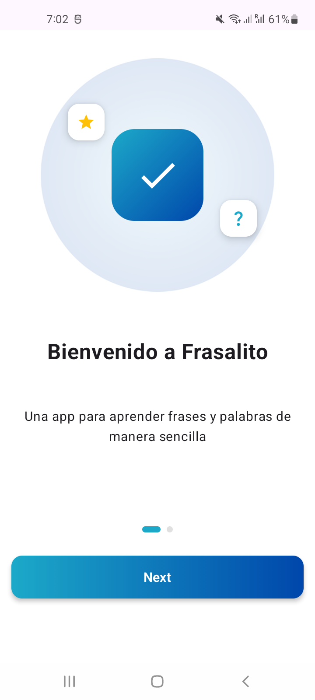
  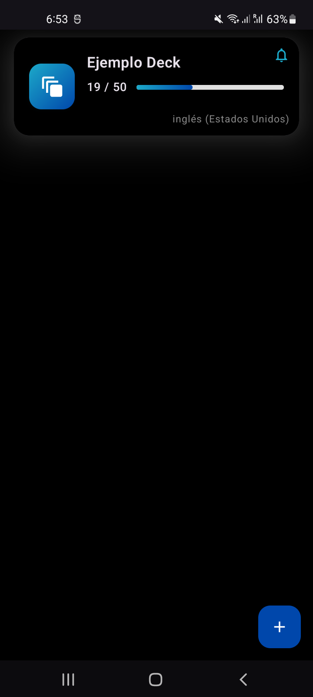
  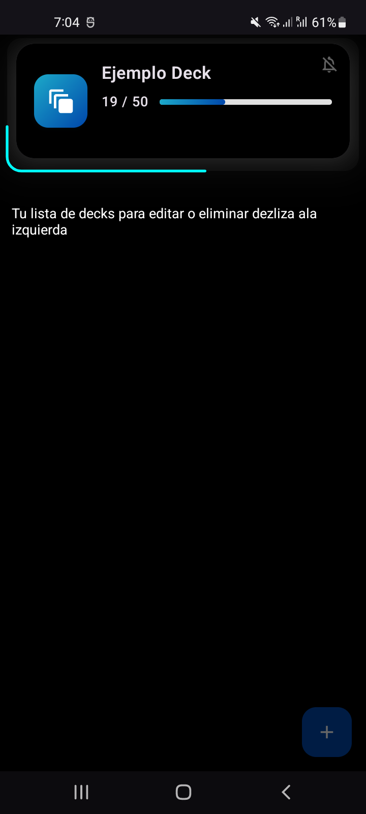
  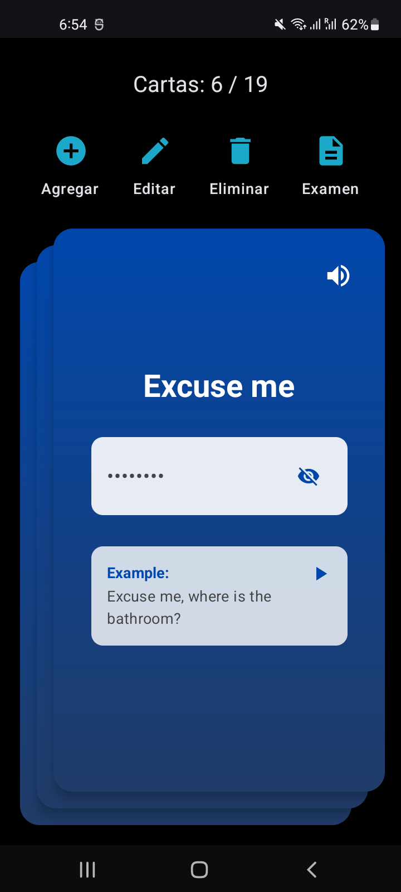
  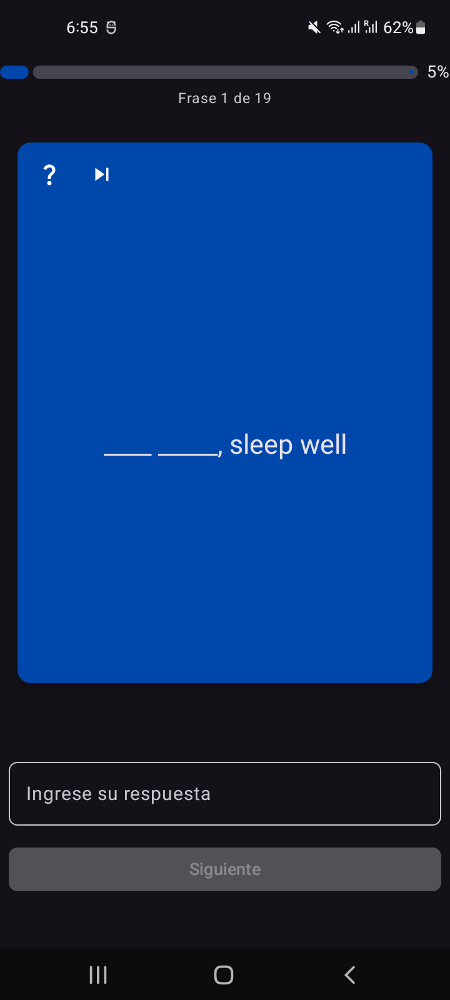
  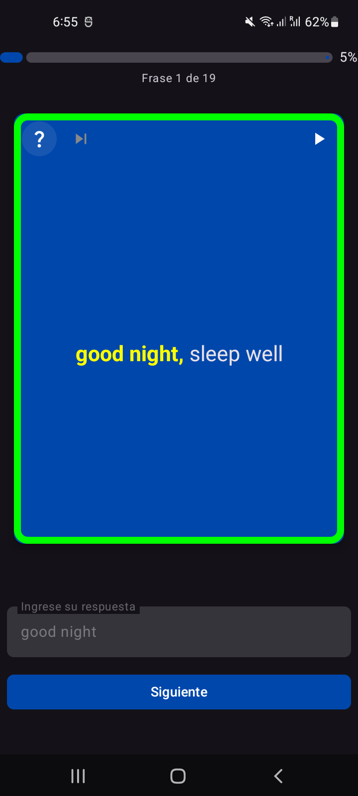
  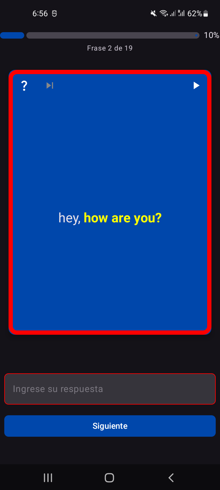
  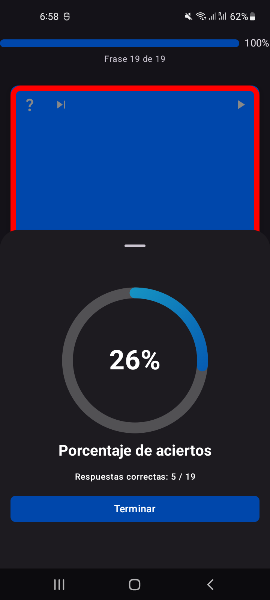
  
</p>


## 🌄 Landscape
<p align="left">
  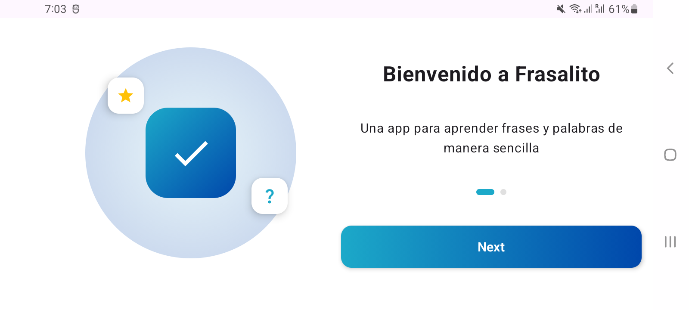
  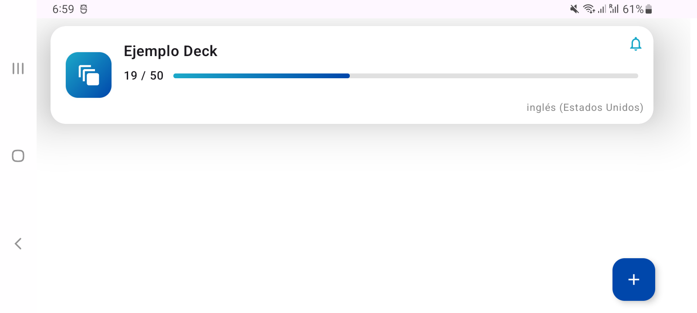
  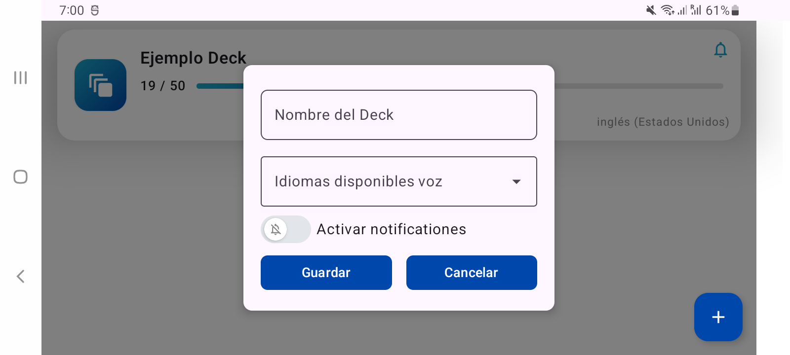
  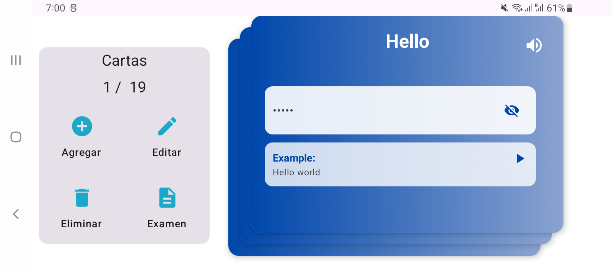
  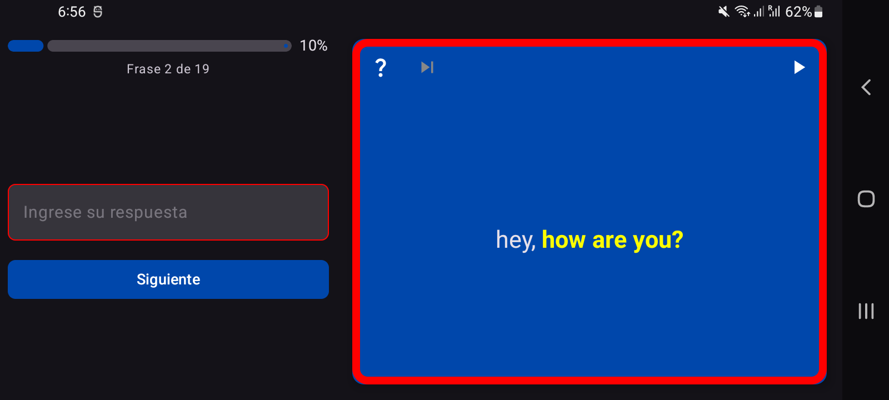
  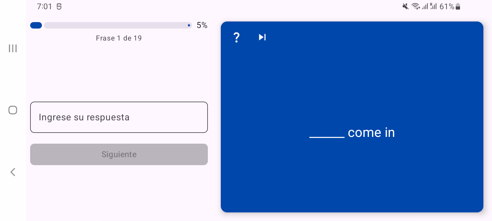
</p>
